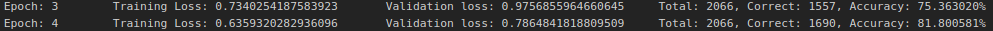
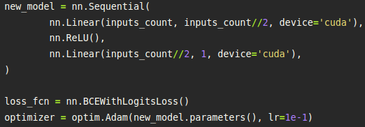
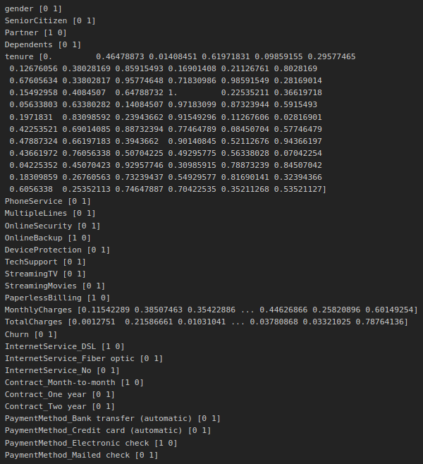

# Achieving 82% prediction accuracy using Dense Neural Networks
### Results

### Model

### Ok, but how?
The tech stack:
1. `pytorch`
2. `imblearn`
3. `sklearn`
4. `pandas`  
All these and their dependencies can be installed by running `conda env create -f environment.yml`.  
### Pre-Processing

*Cleaned*, *Encoded*, and *Scaled*

