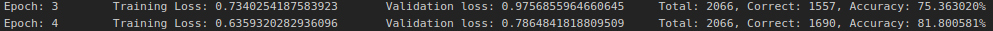
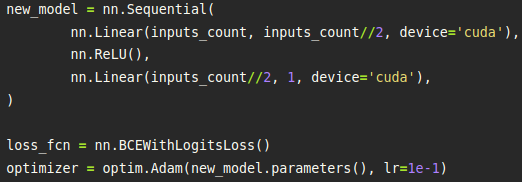
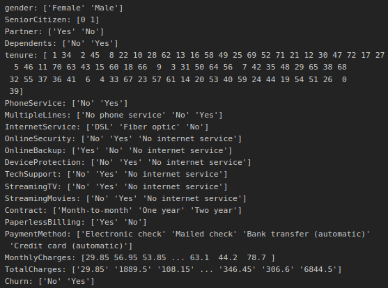
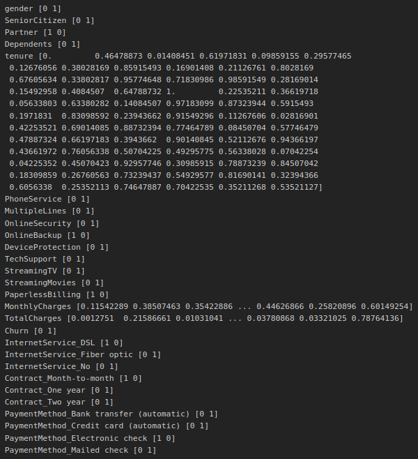
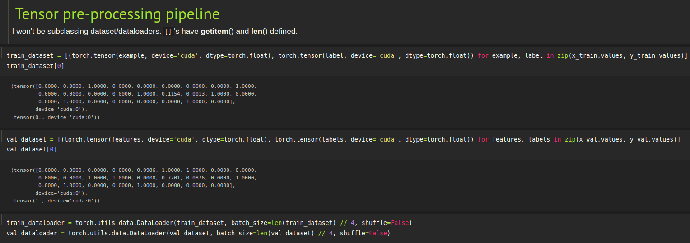

# Achieving 82% prediction accuracy using Dense Neural Networks
### Results `81.80%`
  
### Model
  
### Ok, but how?
The tech stack:  
1. `pytorch`
2. `imblearn`
3. `sklearn`
4. `pandas`  
All these and their dependencies can be installed by running `conda env create -f environment.yml`.  
### Pre-Processing
I take this  
  
Then after *Cleaning*, *Encoding*, and *Scaling*.    
  
### Fed into dataloader
  
### Supplementary technical omissions
1. Learning rate annealing
2. Embeddings (Guo and Berkhan, 2015)
3. Synthetic Minority Oversampling

### For those interested
No subclassing of `torch.utils.data.Dataset` was performed. No one was harmed in the making of this film.  
The combination of `nn.LogSoftmax` and `nn.NLLLoss` is exactly mathematically equivalent to `nn.CrossEntropyLoss`, hence the omission.
